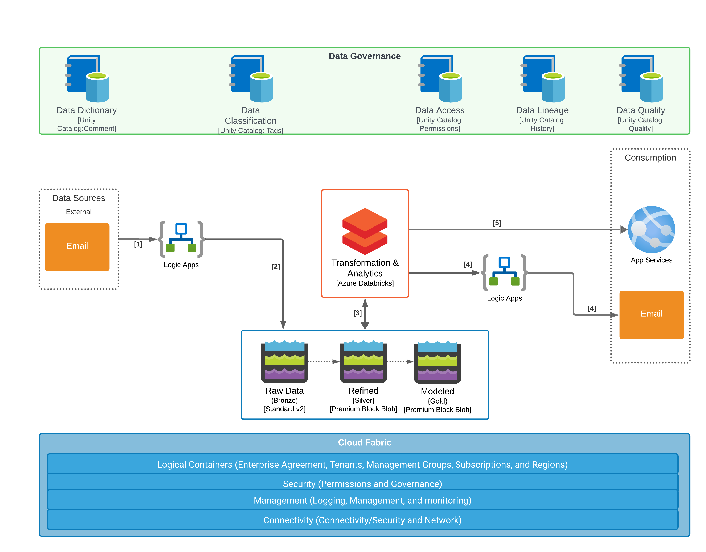

# oghma-arrangement
OpenTofu for an Azure based Analytics and Reporting Platform

## Overivew
This repository is a complete set of code to stand up an Azure based Analytics and Reporting platform. The platform design allows for both batch and realtime processing of data containing all of the necessary resources for, data retrieval, reporting, analytics, machine learning, and notification. The platform is deployed in a way that encapsulates and secures the resources making it acceptable to the most robust security requirements. The initial use case for this platform automated analytics and reporting with request originating from outside of the platform itself. Email is a generally accepted as part of business workflows so the solution leverages it in the solution design. The idea is that there is business value being able to seamless add analytics into existing workflows with little to no changes in the existing process from a tooling perspective except for a minimal change in forwarding emails to a specific mailbox to add additional analytics. Further solution information can be found in the documentation folders [README.md](./documentation/README.md)

### Conceptual Diagram
1. Logic apps identifies a new email grabbing the email identifiers and that of any attachments
2. Logic apps places the email metadata, body, and attachments in the raw storage account
3. Databricks processes new emails as they come in including OCR of attachments and LLM data extraction saving the processed information as relational tables
4. An email acknolwedment as inital communication is sent back to the email sender using logica apps
5. Additional reporting overtop of the Databicks Unity Catlog using Azure Web Apps 

## Getting Started
1. This project is expects resources created by [wrgcli](https://github.com/westridgegroup/wrgcli) project's OpenTofuAzureBootstrap.sh script to exist.	The script has been imported locally to this repo for now.
2. From bash shell: az login (make sure you are in the correct subscription)
3. From bash shell: source ./wrgcli.sh 
4. From bash shell: tofu_setup ./env/dev.tfvars
4. From bash shell: tofu_plan 	
5. From bash shell: tofu_apply 

### Notes: 
This project follows the standard West Ridge Group OpenTofu famework, state container name and state key information is in the tfvars file. \
The user_groups variable is read at execution time to populate the access control policy \
[OpenTofu](https://opentofu.org) open source fork of Terraform, we switch to OpenTofu due to the [Terraform licensing change](https://www.hashicorp.com/en/license-faq) in August 10th of 2023.

## Platform Details
The Databricks workspace, key vault, storage and logic app are all wrapped in a vnet and do not all for external access directly from the internet.   All resource connectivity is via private endpoints with the except of Fabric which uses VNET Data Gateways.

### Data Storage Accounts
#### Raw
- This storage account is used to hold raw data.  The idea is that everything can be rebuilt from this storage account.  Because of that reason we use GRS.  Since this storage account will be used to rebuild data objects from scratch were are intending to not delete data from this storage account.  This causes us to use BlobStorage as well at the Standard tier to help with cost control.  
- Settings:
    - account_tier = "Standard"
    - account_replication_type = "GRS"
    - account_kind = "StorageV2"
    - access_tier = Hot
    - https_traffic_only_enableed = true
    - shared_access_key_enabled = false
    - public_network_access_enabled = true # But restricted to a set of IPs
    - default_to_oauth_authentication = true
    - is_hns_enabled = true 
    - local_user_enabled = false
    - allow_nested_items_to_be_public = false
- Private Endpoint for Blob connected to the Private Endpoint subnet
#### Refined
- This storage account is used to hold data that has been refined from raw.  This data will be accessed frequently and potentially by end user reporting.   For faster performance BlockBlobStorage at the Premium tier has been choosen for better performanc than what was used on the Raw Storage layer.  LRS has been choosen over GRS as we should be able to rebuild everything from Raw in necessary so LRS provides enough protection from data loss.  Lastly the hierarchial namespace is used to allow for easier managment of the data from allowing folders.  
- Settings:
    - account_tier = "Premium"
    - account_replication_type = "LRS"
    - account_kind = "BlockBlobStorage"
    - access_tier = N/A
    - https_traffic_only_enableed = true
    - shared_access_key_enabled = false
    - public_network_access_enabled = true # But restricted to a set of IPs
    - default_to_oauth_authentication = true
    - is_hns_enabled = true 
    - local_user_enabled = false
    - allow_nested_items_to_be_public = false
- Private Endpoint for Blob connected to the Private Endpoint subnet
#### Modeled
- This storage account is similar to the Refined storage account for the same reasons.  The only difference is that this storage account is data in layer is expected to be seen and used by the end uses applications.  This storage account needs to be 
- Settings:
    - account_tier = "Premium"
    - account_replication_type = "LRS"
    - account_kind = "BlockBlobStorage"
    - access_tier = N/A
    - https_traffic_only_enableed = true
    - shared_access_key_enabled = false
    - public_network_access_enabled = true # But restricted to a set of IPs
    - default_to_oauth_authentication = true
    - is_hns_enabled = true 
    - local_user_enabled = false
    - allow_nested_items_to_be_public = false
- Private Endpoint for Blob connected to the Private Endpoint subnet
   
#### Logging
- This storage account is used for Diagnostic Logging accross all resources.  The idea is that Databricks will used to investigate the logs.
- Settings:
    - account_tier = "Standard"
    - account_replication_type = "LRS"
    - account_kind = "StorageV2"
    - access_tier = N/A
    - https_traffic_only_enableed = true
    - shared_access_key_enabled = false
    - public_network_access_enabled = true # But restricted to a set of IPs
    - default_to_oauth_authentication = true
    - is_hns_enabled = false 
    - local_user_enabled = false
    - allow_nested_items_to_be_public = false
- Private Endpoint for Blob connected to the Private Endpoint subnet

### Vnet Details
Class B Network starting at: 130.1.0.0/16
If we need additional networks that talk to one another they would take the next class B 130.2.0.0/16.  An example would be to have one instance of this code for Development and another for production.  Each section below describes specific resource configuration.  
- DDoS Network Protection: Disabled
- DNS Server: Default
- Diagnostic Settings:
    - All Logs
    - All Metrics
    - Archive to Storage Account: XXX

#### Subnets
- Gateway 
    - CIDR: 10.30.1.0/24
    - NSG:
    - Route Table:
- Databricks Internal 
    - CIDR: 10.30.1.0/24
    - NSG:
    - Route Table:
- Databricks External 
    - CIDR: 10.30.2.0/24
    - NSG:
    - Route Table:
- Private End Points (Storage and Key Vault) 
    - CIDR: 10.30.3.0/24
    - NSG:
    - Route Table:
- Vnet Datagateway 
    - CIDR: 10.30.4.0/24
    - NSG:
    - Route Table:
- Logic App 
    - CIDR: 10.30.5.0/24
    - NSG:
    - Route Table:
- VM 
    - CIDR: 10.30.6.0/24
    - NSG:
    - Route Table:
- Bastion 
    - CIDR: 10.30.7.0/24
    - NSG:
    - Route Table:

### NSGs

### Resource Groups
- Logging resources: logging-rg
- Networking resources: vnet-rg
- Databricks Public
- Databricks Private
- Three seperate storage account rgs: raw-rg, refined-rg, modeled-rg
- Key Vaults (for all)
- Logic Apps (For all)
- VM (one for each vm including all of the resources for the VM)
- Bastion

 ### Databricks Configuration
- Make it secure
- Settings:
    - managed_resource_group_name = "SAME_AS_RG-databricks-managed-rg"
    - location            = eastus2
    - sku                 = "premium"
    - customer_managed_key_enabled = true
    - public_network_access_enabled = false
    - enhanced_security_compliance 
        - automatic_cluster_update_enabled = true
        - compliance_security_profile_enabled = true
    - custom_parameters
        - public_subnet_name = the databricks external subnet
        - private_subnet_name = the databricks internal subnet
        - storage_account_name = using the storage account prefix plus databricksdefault
        - storage_account_sku_name = "PremiumLRS"

 