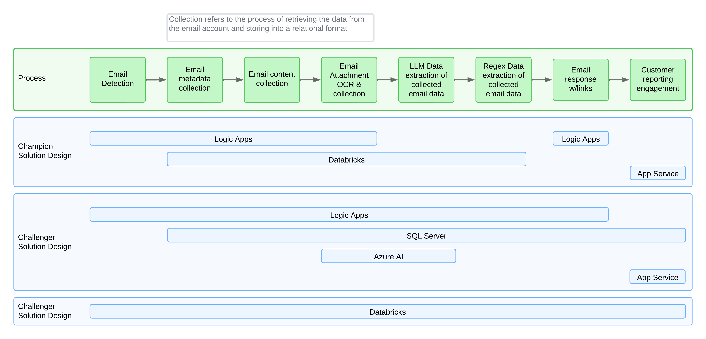

# oghma-arrangement & cuddly-octo-invention
This is a joint documentation for the infrastructure and the initial solution that sits on top of it.  There are two code repositories the oghma-arragment and the cuddly-octo-invention that come together to form a complete solution.  The idea is that the platform represented and codified in the oghma-arrangement can be utilized for additional solutions going forward.  The cuddly-coto-invention is the email intake based analytics solution that sits on top of the platform.
[oghma-arrangement](https://github.com/westridgegroup/oghma-arrangement)
[cuddly-coto-invention](https://github.com/westridgegroup/cuddly-octo-invention)

## Conceptual Solution
There are many ways to build a solution but they influenced by the platform they ride upon.  In the cloud the application team has much more freedom then in a traditional data center as the platform stack is very easy to switch out so solutions are more more free to come up with designs that vary in platform then they used to.  Below is a conceptual diagram that details out the major steps in the cuddly-cot-invention email intake based analytics solution at the top in the process box followed by three different platform stacks that could support the solution.  The Champion solution design is the what is produced by the oghma-arrangement OpenTofu code.  The other two Challenger solution designs are options that we did not pursue.

### Details on Champion solution (Databricks Centric)
This solution was chosen as the champion as it is the most versatile and allows for a more robust front end portal using App Services and provides simplified connections and integrations using Logic Apps. 
1. Logic Apps is responsible for retrieving emails, and writing the information including attachments to raw storage.  On the back end of the process Logic Apps is responsible for sending an email response to the original sender
2. Databricks is responsible for organizing the email metadata saving it to tables.  Using LLMs to extract information from the body of the email.  OCRing the attachments, using LLMs and regex to extract information from those documents as well as tabularizing all of that information into tables for further reporting.  Lastly it formulates an email response and calls a logic app to return an email to the original sender.
3. App Services is responsible for presenting a Portal interface for the end user, mainly related to reporting and surfacing analytics information.  Links to the App Service pages would be included in the email sent back to the original sender by Logic Apps.

### Details on Challenger solution #1 (Logic Apps Centric)
1. Logic Apps is responsible for retrieving emails, and writing the information including attachments to raw storage.  On the back end of the process Logic Apps is responsible for sending an email response to the original sender.  Logic Apps is also responsible for organizing the email metadata saving it to tables.  Using calls to different Azure AI services to extract information from the body of the email.  Calling Azure AI services to OCR the attachments, using LLMs and regex to extract information from those documents as well as tabularizing all of that information into tables for further reporting.  Lastly it formulates an email response and calls a logic app to return an email to the original sender.
2. The SQL Database is used as storage for the tabularized data as well as the source for reporting
3. App Services is responsible for presenting a Portal interface for the end user, mainly related to reporting and surfacing analytics information.  Links to the App Service pages would be included in the email sent back to the original sender by Logic Apps.

### Details on Champion solution (Databricks Heavy)
1. Databricks does it all.  Databricks is responsible for retrieving emails, and writing the information including attachments to raw storage.  On the back end of the process Databricks is responsible for sending an email response to the original sender.  Databricks is responsible for organizing the email metadata saving it to tables.  Using LLMs to extract information from the body of the email.  OCRing the attachments, using LLMs and regex to extract information from those documents as well as tabularizing all of that information into tables for further reporting.  Lastly it formulates an email response and calls a logic app to return an email to the original sender. Databricks Apps is responsible for presenting a Portal interface for the end user, mainly related to reporting and surfacing analytics information.  Links to the Databricks App would be included in the email sent back to the original sender by Logic Apps.

## Cost Efficiency
To forecast a cost for running this solution we used the following assumptions and requirements:
- 1000 emails a month are processed
- Each email on average contained 2 documents for a total of 10 MB in size including email metadata and body text
- The solution would receive emails 24 x 7
- The solution would receive reporting requests 24 x 7
- Any compute resource that could respond with on demand resources would assume 80 hours of processing a month, otherwise 24x7 is required.

#### Champion Solution #1 forecast: $2300/month
- Same Raw Storage Costs across all 3 solutions ~$10/month
- Refined and Modeled Storage ~$20/month
- Same App Service Costs in Champion and Challenger #1 ~$200/month
- Databricks SQL running 80 hours to support expected queries from reporting ~$700/month
- Databricks Job Cluster running 80 hours to support expected analytics processing ~200/month
- Databricks Hosted Model Calls - 20,000 = 20000 calls *5000tokens/1,000,000=1400 DBUs ~$800/month
- Logic Apps 10,000 standard calls for Email data collection ~$180/month
- Logic Apps 1,000 standard calls for outbound email  ~$20/month
- App Service running 24x7 ~$100/month
- [Details](./ExportedEstimate_1.pdf)
#### Challenger Solution #2 Forecast Cost: $1200/month
- Same Raw Storage Costs across all 3 solutions ~$10/month
- Same App Service Costs in Champion and Challenger #1
- Logic Apps 10,000 standard calls for Email data collection
- Logic Apps 20,000 standard calls for OCR
- Logic Apps 20,000 enterprise calls for LLM data extraction (call to AI Vision)
- Logic Apps 20,000 standard calls for regex data extraction (call to AI Vision)
- Logic Apps 1,000 standard calls for outbound email 
- Azure AI Vision 20,000 calls for OCR
- Azure AI Language 20,000 calls for LLM data extraction across all three Summarization, Sentiment Analysis, & Customer Questions
- Azure SQL running 24x7 2vCore very small
- Details
#### Challenger Solution #3 Forecast Cost: ~$2600
- Same Raw Storage Costs across all 3 solutions ~$10/month
- Refined and Modeled Storage ~$20/month
- Databricks SQL running 80 hours to support expected queries from reporting ~$700/month
- Databricks Job Cluster running 320 hours to support expected analytics processing ~$800/month
- Databricks Hosted Model Calls - 20,000 = 20000 calls *5000tokens/1,000,000=1400 DBUs ~$800/month
- Databricks App 24x7 ~$300
- Details
